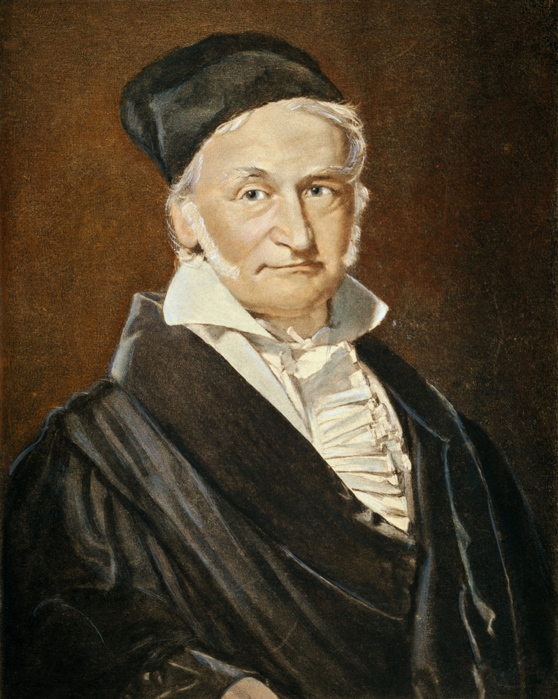

```{r setup, include=FALSE}
knitr::opts_chunk$set(echo = TRUE)
```

Normal (Gaussian) Histogram
```{r}
Y <- rnorm(100)
hist(Y)
```

Who was Karl Friedrich Gauss?


Gauss was a famous German mathematician and physician, who lived from 1777-1855 and made notable contributions to math and physics.

<<<<<<< HEAD
=======

>>>>>>> 17d5a10fe20788d8c9969c9b50fc008f31dcb582
